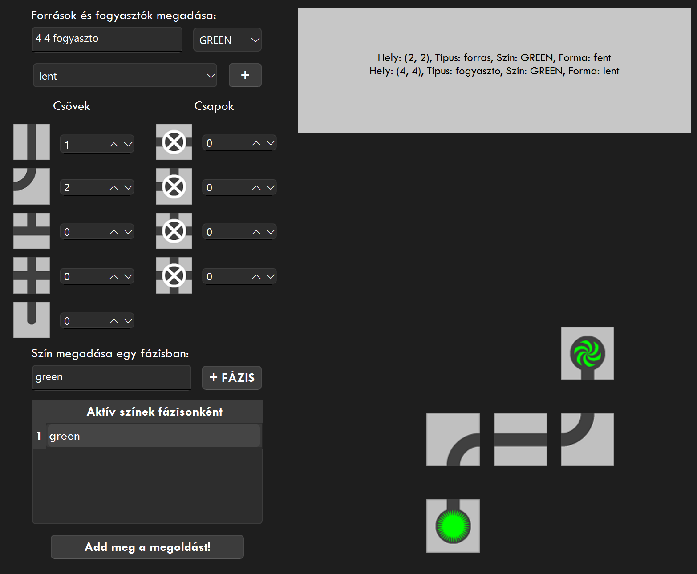

# Pipe Flow GUI Solver

This is a graphical C++ application developed using the Qt framework. It allows users to configure and solve a pipe network that connects **sources (forrás)** to **sinks (fogyasztó)** using various pipe shapes. The GUI is **in Hungarian**, and the visualization highlights **correct connections using green color** when sources and sinks are connected successfully.

---

## Features

- GUI in Hungarian
- Define custom sources and sinks with position, color, and shape
- Visual representation of the tile map grid
- Interactive phase-based color configuration
- Intelligent solver with a backtracking algorithm
- Successful connections are visualized in green for both sources and sinks
- Dynamic valve rearrangement based on surrounding tile priority

---

## Installation

### Prerequisites

- Qt (version 5 or 6)
- C++17 compatible compiler (e.g. GCC, MSVC)
- CMake (if using outside of Qt Creator)

### Build Instructions (Qt Creator)

1. Open the `.pro` or `.cpp` project with **Qt Creator**.
2. Configure the Qt Kit and click **Run** or **Build**.

---

## How to Use the GUI

1. **Add Sources and Sinks**
   - Use the **text field** (e.g. `2 3 forras`) to enter location and type.
   - Select **color** from the dropdown (recently for the correct visual display `GREEN` is available only)
   - Select **shape** (e.g., `fent`, `lent` etc.)
   - Click the `+` button to add.

2. **Configure Phases**
   - Input active colors for a phase (e.g., `red green`) in the bottom text area.
   - Click `+ FÁZIS` to register the phase.

3. **Set Pipe Supply**
   - Use the spinboxes to configure how many pipes of each type you have.

4. **Solve**
   - Click the **"Add meg a megoldást!"** button.
   - If a valid solution is found, the tile grid will be updated.
   - Correct connections to sinks will be shown using **green color**.

---

## Tile Types

- **Straight Pipes**
- **Curved Pipes**
- **T-Pipes**
- **Cross Junctions**
- **Valves** (can switch place with pipes during rearrangement)

Each tile is visualized with a corresponding image (e.g., `kanyar0.png`, `tcso0.png`, etc.).

---

## Project Structure

`pipe_flow_solver/
├── coord.cpp
├── coord.h
├── main.cpp
├── mainwindow.cpp
├── mainwindow.h
├── mainwindow.ui
├── tile.cpp
├── tile.h
├── tilemap.cpp
├── tilemap.h
├── nagybeadando_v10.pro
├── resources.qrc
├── images/                 # Folder containing all GUI images
│   ├── egyenescso0.png
│   ├── kanyar0.png
│   ├── tcso0.png
│   └── ...
├── README.md               # Project documentation
├── .gitignore              # Git ignore rules (optional)
`

---

## Language

- All GUI text and labels are in **Hungarian**.
- Internal comments and variable names follow a mixed English/Hungarian naming convention.

---

## License

This project is shared for educational and personal use purposes. No commercial use is permitted unless explicitly granted.

---

---

## Contributions

Pull requests and suggestions are welcome! Please ensure contributions are documented and cleanly structured.
